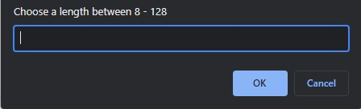
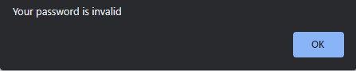

# Password-Generator

This application uses Javascript to generate a random password for its users.

## Table of Contents

1. [Installation](#installation) 
2. [Usage](#usage)
3. [License](#license)

## Installation

This application is deployed to github pages!

you can either 

Follow this link : https://immemx.github.io/Password-Generator/  
~ OR ~  
Use Git Clone to clone this code down to your local machine.

## Usage

Start by click the Red "Generate Password" button.  
  
  

First you will enter the length of the password you would like to generate.  
you mush choose between 8-128.  

  

Any amount not meeting this criteria will result in an error.

  

You will then answer a series of window alerts defining the criteria of your password.  

Then SHAZAM! your highly secure, super personalized password is zapped into existance.

## License 

  Copyright 2021

Permission is hereby granted, free of charge, to any person obtaining a copy of this software and associated documentation files (the "Software"), to deal in the Software without restriction, including without limitation the rights to use, copy, modify, merge, publish, distribute, sublicense, and/or sell copies of the Software, and to permit persons to whom the Software is furnished to do so, subject to the following conditions:

The above copyright notice and this permission notice shall be included in all copies or substantial portions of the Software.

THE SOFTWARE IS PROVIDED "AS IS", WITHOUT WARRANTY OF ANY KIND, EXPRESS OR IMPLIED, INCLUDING BUT NOT LIMITED TO THE WARRANTIES OF MERCHANTABILITY, FITNESS FOR A PARTICULAR PURPOSE AND NONINFRINGEMENT. IN NO EVENT SHALL THE AUTHORS OR COPYRIGHT HOLDERS BE LIABLE FOR ANY CLAIM, DAMAGES OR OTHER LIABILITY, WHETHER IN AN ACTION OF CONTRACT, TORT OR OTHERWISE, ARISING FROM, OUT OF OR IN CONNECTION WITH THE SOFTWARE OR THE USE OR OTHER DEALINGS IN THE SOFTWARE.